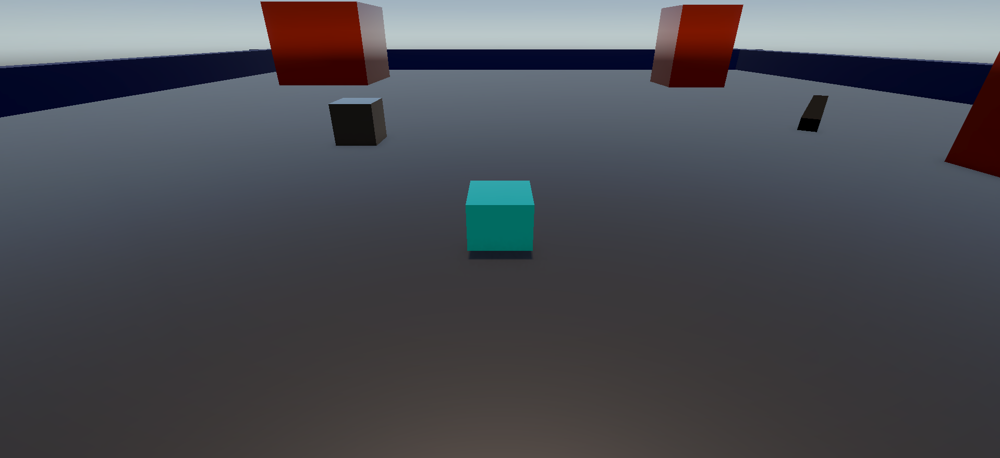
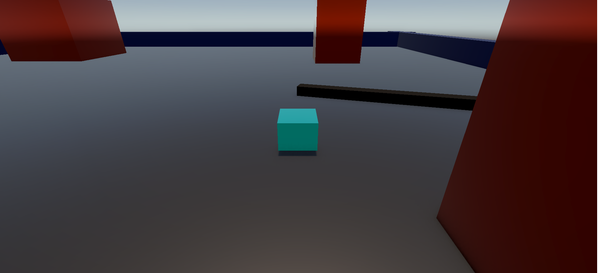

# First-Game-Experience

This is my first attempt at game development while learning Unity. The goal was to practice basic game mechanics such as movement, triggers, scene management, projectiles, and Unity's core systems.

## What I Learned
- Unity Basics
- Prefab workflow and object reuse
- Basic C# scripting in Unity
- Scene management and object organization
- Positioning objects and using the Transform component
- Trigger-based interactions
- Simple project structure
- Basic scripting principles

## Features
- Trigger-based interactions
- Clear and simple project structure
- First use of prefabs and basic game mechanics

## About Project
This project is not a professional game.  
It represents my first step into game development in Unity.

## Tools & Technologies
- Unity
- C#
- Unity Documentation
- Git/GitHub

# About Game

This game is controlled using only the WASD keys and features obstacles that the player can collide with. When the player hits an obstacle, it affects their health and changes the color of the obstacle.

Since this was my first Unity project, it served as an educational and instructional game, helping me learn the fundamentals of game development.

Some key mechanics include:

- **Trigger volumes:** Entering specific trigger areas activates "ball" objects that follow the player.
- **Falling objects:** After a few seconds from the start of the game, certain objects begin moving to block the player’s path.
- **Spinner obstacles:** On the right side, a continuously spinning object is designed to challenge the player and force them to navigate carefully.

Overall, the game was a hands-on way for me to practice movement, collisions, triggers, and basic obstacle mechanics in Unity.

## Screenshots

### Main Scene

### Trigger Balls

### Colision Result

### Spinner Obstacle

